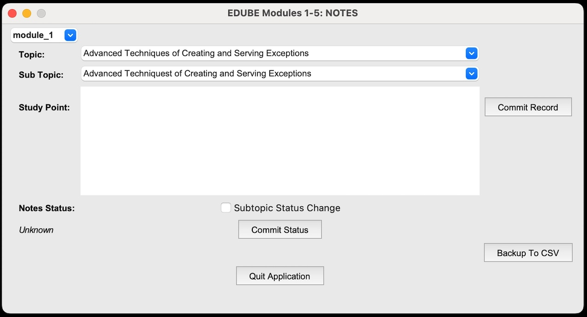
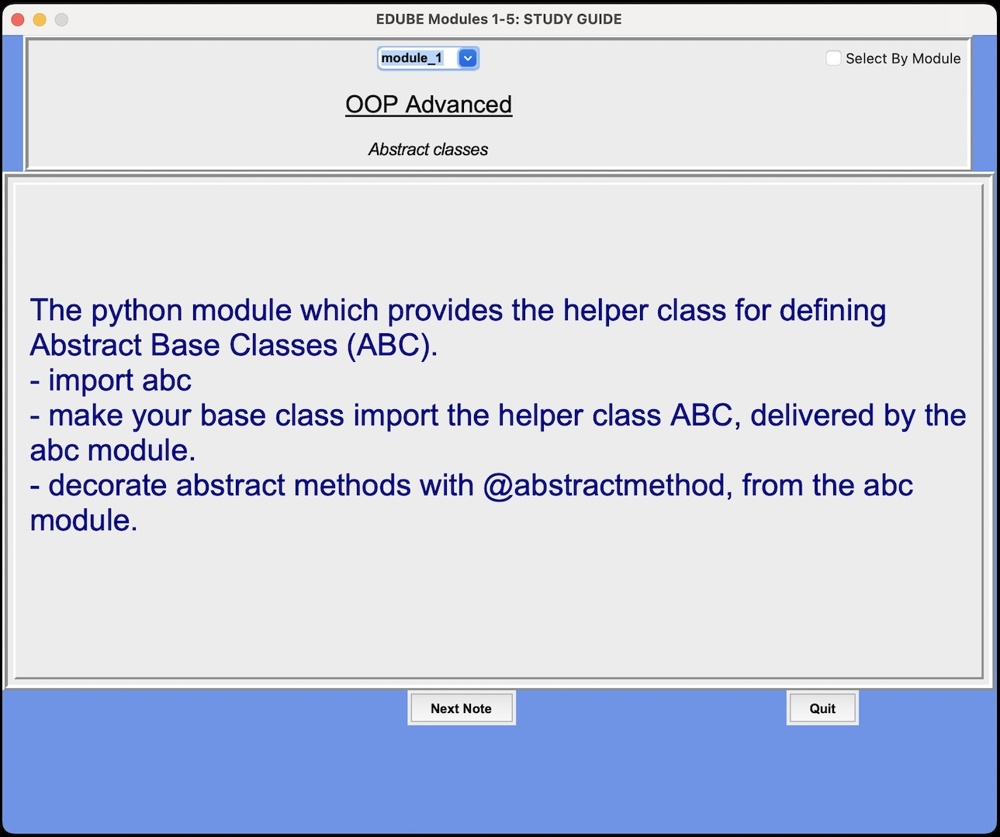

### Title: Professional Python Certification (PCPP1), Tkinter Test Prep GUI Applications.

*To see the full codebase for this project:*
[Link to my github account](https://github.com/dcremas/cert_testprep)

#### Description:

##### A project intended to build out two fully functioning desktop applications --> one to take notes and persist the notes to a database, and then another application built to access that database and display those notes in the most effective way to aid in learning for the certification exam.
##### Purpose:

The ultimate purpose of this project was to have an efficient user-friendly graphical desktop application to persist all of the necessary study notes to a relational database. Additionally, a second gui application was built using the tkinter toolking that utilized all of the notes that existed within the sqlite database to aid in studying for the certification exam. 

##### Tkinter Desktop Applications Development Process:

- Using all of the resources provided by the OPENEDG learning platform, build out the topics hierarchy that will be the basis for categorizing the notes.
- Build out two fully functioning tkinter desktop applications, one for taking notes from the OPENEDG modules, and the second application for exam study.
- Set up a process to regularly back-up the data in the database to .csv files to ensure no loss of work.
- Utilize Jupyter Lab notebook to transform the textual data from the topics and notes tables into rich word cloud visualizations, to help with studying.

##### Technologies:

1. Python.
2. Tkinter toolkit and various standard library modules.
3. Sqlite database (via sqlite3 module).
4. Data visualization techniques including WordClouds, using matplotlib and wordcloud.

##### Folder Structure:

Main Level: Includes the python scripts, sqlite database and jupyter notebook as well as the folders for the following:

- /extract_files csv files used for data backup in case of database failure.
- /wordclouds - a full set of image files produced to glean out the most relevant words/phrases.

##### Collaborators:

Thank you to the Python Institute and the OPENEDG platform for the rich and expansive free learning modules that were available for studying, and also for the many lab within the curriculum that were available for practice.

##### Application Images (Notetaking & Studying):

